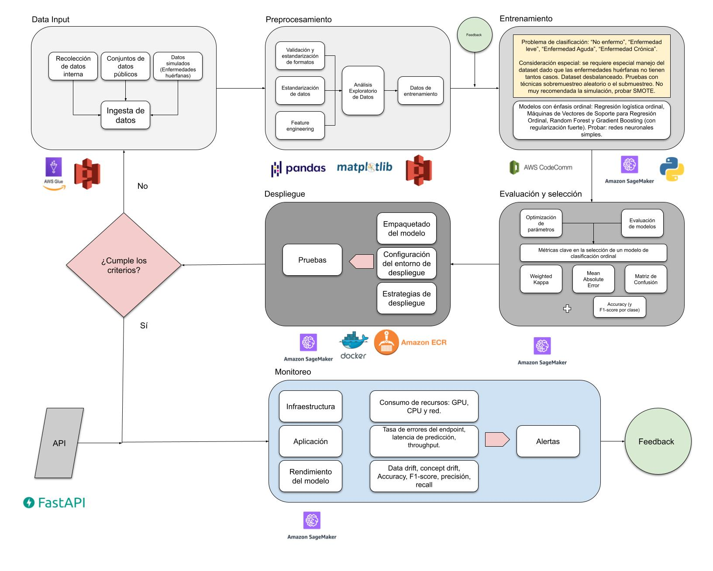

# Sistema de Diagnóstico Médico con IA

## Problema

En el campo de la medicina moderna, la cantidad de información disponible sobre pacientes es abundante. Sin embargo, para enfermedades poco comunes (conocidas como "huérfanas"), los datos escasean considerablemente. Este proyecto aborda el desafío de desarrollar un modelo de inteligencia artificial capaz de predecir posibles enfermedades a partir de los síntomas presentados por un paciente, funcionando efectivamente tanto para enfermedades comunes (con muchos datos disponibles) como para enfermedades huérfanas (con pocos datos).

## Propósito

El sistema está diseñado para servir como herramienta de apoyo al diagnóstico médico, disponible 24/7 para consulta por parte de profesionales de la salud. El modelo analiza datos de síntomas y perfil del paciente para sugerir posibles diagnósticos, actuando como un complemento al conocimiento y experiencia médica, sin pretender reemplazar el diagnóstico profesional.

# Ejecución del Modelo

## Para ejecutar el modelo:

Ubicarse dentro de la carpeta model
Asegurarse de que la aplicación "Docker Desktop" esté en ejecución
Ejecutar los siguientes comandos:

bash# Detener cualquier contenedor previo
docker-compose down

## Reconstruir la imagen 
docker-compose build --no-cache

## Iniciar el contenedor
docker-compose up

El modelo estará disponible para realizar predicciones bajo demanda y cuenta con monitoreo constante para garantizar su rendimiento y precisión a lo largo del tiempo.

# Taller 3 MLOps -> V3.0

## Caso de estudio
### Antecedentes

Dados los avances tecnológicos, en el campo de la medicina la cantidad de información que existe de los pacientes es muy abundante. Sin embargo, para algunas enfermedades no tan comunes, llamadas huérfanas, los datos que existen escasean. Se requiere construir un modelo que sea capaz de predecir, dados los datos de síntomas de un paciente, si es posible o no que este sufra de alguna enfermedad. Esto se requiere tanto para enfermedades comunes (muchos datos) como para enfermedades huérfanas (pocos datos). 

## Definición del problema

### Entrenamiento del modelo

El modelo será entrenado manualmente por un ingeniero de ML.

El dataset de entrenamiento [link](https://www.kaggle.com/datasets/uom190346a/disease-symptoms-and-patient-profile-dataset/data) tiene síntomas asociados a las enfermedades.

Los datos serán evaluados en un Análisis Exploratorio de Datos (EDA) para identificar su estructura interna. Se entrenarán varios modelos de clasificación y se escogerá el que mejor desempeño tenga, asegurando así el mejor rendimiento.

### Tarea de predicción

El conjunto se pondrá a disposición 24hrs a través de una API habilitada en localhttp://localhost:5000/docs. Se espera que el punto de solicitudes se encuentre disponible 7 días a la semana para su consulta. Se debe ingresar al link proporcionado, a continuación dar click en "try", ingresar los datos solicitados y, finalmente, click en "execute".

### Parte 1: diseño del pipeline de ML

Se propone el siguiente diagrama de pipeline para el problema en cuestión:

!

### Data Input:

El modelo se entrenará con datasets especializados en los que se incluyan mediciones clínicas, como presión, temperatura, etc. Y también síntomás anunciados por el paciente u observados por el médico. Para poder llevar a cabo el diagnóstico, se tendrá en cuenta datos de la historia clínica del paciente, exámenes, resultados de laboratios etc. Los datos serán almacenados en AWS S3 y procesados en AWS Glue. El dataset se prevee que se encuentre desbalanceado ya que las enfermedades huérfanas, por definición, no tienen suficientes casos como para ser representativos en el dataset. Se evaluará la opción de simular datos de enfermedades huérfanas para contemplar la opción de conservar la simulación u optar por el sobremuestreo aleatorio, el submuestr o el cost-Sensitive learning con una matriz de costos ordinales.

### Preprocesamiento:

A continuación, se llevará a cabo un ejercicio de validación de los formatos con los dataset de entrenamiento y una posterior validación de los datos para estandarizarlos. Se implementa el features engineering con el fin de comprender la importancia de las variables a la predicción de la enfermedad. Finalemente, se procede con un análisis exploratorio de datos (EDA) para entender la estructura de los datos y sus variables. En un siguiente momento, se comenzará con el entrenamiento, optimización y validación del mejor modelo para el caso de estudio.

El preprocesamiento se llevará a cabo utilizando librerías de Python como Pandas y Matplotlib. El producto resultante será almacenado en AWS S3.

### Selección y Evaluación del Modelo:

El problema planteado obedece a uno de tipo clasificación, según las siguientes etiquetas: “No enfermo”, “Enfermedad leve”, “Enfermedad Aguda”, “Enfermedad Crónica”, "Enfermedad Terminal". Con esto en mente y la consideración hecha anteriormente sobre el desbalance del dataset en relación a las enfermedades huérfanas, se proponen los siguientes modelos para ser evaluados: Modelos con énfasis ordinal: Regresión logística ordinal, Máquinas de Vectores de Soporte para Regresión Ordinal, Random Forest y Gradient Boosting (con regularización fuerte). Probar: redes neuronales simples.

Como se puede observar, se hace especial énfasis en el tipo de modelos de clasificación para su evaluación ya que los modelos estándar de clasificación tratan las clases como categorías nominales (sin orden inherente), lo que significa que un error al clasificar "No enfermo" como "Enfermedad Crónica" se penaliza igual que clasificar "No enfermo" como "Enfermedad leve", lo cual no es deseable. Por tanto, se ha optado por modelos de clasificación ordinales.

Adicionalmente, se debe tener en cuenta lo siguiente: dado que la información clínica de las personas no es decaracter público, se espera que los datos para entrenamiento sean pocos. Por tanto, no se usarán modelos demasiado complejos (Ensamles complejos o redes muy profundas) para asi evitar el sobreajuste. Para ello, se exploran alternativas como la Regresión Logíistica Ordinal, modelo especialmente diseñado para este tipo de aplicaciones, que puede servir de base para la comparación de modelos. 

Los modelos serán evaluados y comparados utilizando las siguientes métricas: Weighted Kappa, Mean Absolute Error, Matriz de Confusión
más las métricas del Accuracy y F1-score por clase.

Profundización en las métricas y su importancia:

Weighted Kappa: Penaliza más los errores grandes, por ejemplo, predecir "Crónica" cuando es "No enfermo" que los errores pequeños como predecir "Leve" cuando es "Aguda".

Mean Absolute Error (MAE) (sobre etiquetas numéricas): Si codificas "No enfermo"=0, "Leve"=1, "Aguda"=2, "Crónica"=3, el MAE nos dice, en promedio, en cuántas categorías se equivocó el modelo.

Matriz de Confusión: Visualiza dónde se cometen los errores. Idealmente, los errores deberían estar cerca de la diagonal principal.

Accuracy y F1-score por clase: métricas complementarias a las ya mencionadas.

Se utilizará la tecnología de AWS CodeComm para el control de versiones de los modelos. 

### Despliegue del modelo:

En esta etapa se hará la serialización del modelo, es decir, se guardará el modelo seleccionado y entrenado en un formato reutilizable. Se empaquetará el modelo, dependencias y el código de inferencia en una imagen Docker. Con este paso se asegura la consistencia entre entornos. A continucación se configuran los entornos de despliegue. Finalmente se define la estrategia de despliegue Blue/Green; esta estrategia permite mantener dos entornos idénticos (Blue = actual, Green = nuevo). Se despliega el nuevo modelo en Green, se prueba, y luego se redirige el tráfico a Green. Se escoge esta estrategia de despliegue ya que permite rollback (volver a la versión anterior) rápidamente. Esto es crucial ya que la aplicación sirve para la ayuda médica.

Para poder pasar a la etapa de monitoreo es necesario ejecutar algunas pruebas necesarias para garantizar el correcto funionamiento.

1. Pruebas de Humo (Smoke Tests): Verificaciones básicas para asegurar que el servicio del modelo está activo, responde y puede hacer predicciones simples.
2. Pruebas de Integración: Verificar que el modelo desplegado interactúa correctamente con otros componentes del sistema (ej: fuentes de datos, aplicaciones consumidoras).
3. Pruebas de Rendimiento: Evaluar la latencia, el throughput y el uso de recursos del modelo bajo carga simulada.

Una vez superadas las pruebas, se procede con la activación y promoción del modelo. El modelo ya está listo para ayudar la labor médica.

### Monitoreo

Modelo: el modelo debe estar bajo constante monitoreo para garantizar que no hay data drift, model drift y que las métricas como accuracy y precision aún se encuentran en los límites aprobados. 

Aplicación: en la aplicación se debe monitorear la tasa de errores del endpoint, latencia de predicción y throughput.

Infraestructura: dado que la aplicación consume recursos de AWS y esto deriva en costos, es necesario monitorear el consumo de GPU, CPU y red de las peticiones. 

Se definirán los puntos mínimos de las métricas para generar alertas en el monitoreo. Esto con el fin de garanztizar el correcto funcionamiento.

# Para correr el modelo es necesario ubicarse dentro de la carpeta model; estar ejecutando la aplicación "docker desktop" y ejecutar el siguiente código 

## Detener cualquier contenedor previo
docker-compose down

## Reconstruir la imagen 
docker-compose build --no-cache

## Iniciar el contenedor
docker-compose up