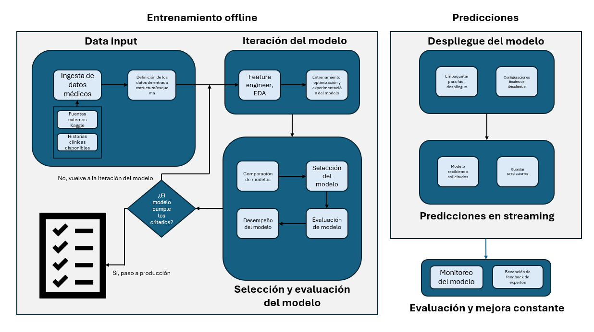

# Sistema de Diagnóstico Médico con IA

## Problema

En el campo de la medicina moderna, la cantidad de información disponible sobre pacientes es abundante. Sin embargo, para enfermedades poco comunes (conocidas como "huérfanas"), los datos escasean considerablemente. Este proyecto aborda el desafío de desarrollar un modelo de inteligencia artificial capaz de predecir posibles enfermedades a partir de los síntomas presentados por un paciente, funcionando efectivamente tanto para enfermedades comunes (con muchos datos disponibles) como para enfermedades huérfanas (con pocos datos).


## Propósito

El sistema está diseñado para servir como herramienta de apoyo al diagnóstico médico, disponible 24/7 para consulta por parte de profesionales de la salud. El modelo analiza datos de síntomas y perfil del paciente para sugerir posibles diagnósticos, actuando como un complemento al conocimiento y experiencia médica, sin pretender reemplazar el diagnóstico profesional.


## Estructura del Repositorio

```
.
├── model/
│   ├── app/
│   │   ├── app.py        # Aplicación principal que expone el API
│   │   └── model.py      # Implementación del modelo de clasificación
│   ├── .dockerignore     # Archivos excluidos de la imagen Docker
│   ├── docker-compose.yml # Configuración de contenedores Docker
│   └── requirements.txt  # Dependencias de Python necesarias
├── img/
│   └── Pipeline1.png     # Diagrama del pipeline de ML
└── README.md            # Este archivo
```

# Ejecución del Modelo

## Para ejecutar el modelo:

Ubicarse dentro de la carpeta model
Asegurarse de que la aplicación "Docker Desktop" esté en ejecución
Ejecutar los siguientes comandos:

bash# Detener cualquier contenedor previo
docker-compose down

## Reconstruir la imagen 
docker-compose build --no-cache

## Iniciar el contenedor
docker-compose up

El modelo estará disponible para realizar predicciones bajo demanda y cuenta con monitoreo constante para garantizar su rendimiento y precisión a lo largo del tiempo.


# Taller 1 MLOps -> V1.0

## Caso de estudio
### Antecedentes

Dados los avances tecnológicos, en el campo de la medicina la cantidad de información que existe de los pacientes es muy abundante. Sin embargo, para algunas enfermedades no tan comunes, llamadas huérfanas, los datos que existen escasean. Se requiere construir un modelo que sea capaz de predecir, dados los datos de síntomas de un paciente, si es posible o no que este sufra de alguna enfermedad. Esto se requiere tanto para enfermedades comunes (muchos datos) como para enfermedades huérfanas (pocos datos). 

## Definición del problema

### Entrenamiento del modelo

El modelo será entrenado manualmente por un ingeniero de ML.

El dataset de entrenamiento [link](https://www.kaggle.com/datasets/uom190346a/disease-symptoms-and-patient-profile-dataset/data) tiene síntomas asociados a las enfermedades.

Los datos serán evaluados en un Análisis Exploratorio de Datos (EDA) para identificar su estructura interna. Se entrenarán varios modelos de clasificación y se escogerá el que mejor desempeño tenga, asegurando así el mejor rendimiento.

### Tarea de predicción

El conjunto se pondrá a disposición 24hrs. 7 días a la semana para su consulta. Esto teniendo en cuenta que el servicio está pensado para ayudar al diágnostico médico, quienes, a su vez, trabajan en turnos que cubren la totalidad del día todos los días.

---

### Parte 1: diseño del pipeline de ML

Se propone el siguiente diagrama de pipeline para el problema en cuestión:

!

## Entrenamiento Offline

### Data Input:

El modelo se entrenará con datasets especializados en los que se incluyan mediciones clínicas, como presión, temperatura, etc. Y también síntomás anunciados por el paciente u observados por el médico. Para poder llevar a cabo el diagnóstico, se tendrá en cuenta datos de la historia clínica del paciente, exámenes, resultados de laboratios etc. Se definirá el esquema que seguirán los datos. 


### Iteración del modelo:

A continuación, se llevará a cabo un ejercicio de EDA y features engineer con el fin de comprender la estructura de los datos. En un siguiente momento, se comenzará con el entrenamiento, optimización y validación del mejor modelo para el caso de estudio.


### Selección y Evaluación del Modelo:

Luego de la etapa de experimentación, se debe decidir cuál es el mejor modelo basado en el desempeño. Una vez se tiene el modelo, se debe evaluar si las métricas que dieron lugar al modelo escogido son suficientes para que el modelo pase a producción. Si no es así, se retorna a la etapa de iteración. 


## Predicciones

### Despliegue del modelo:

En esta etapa se pondrán a punto los requisitos de despliegue; diseño y del o los contendores necesarios para el despliegue. Se requiere que la puesta a punto incluya un momento de prueba para garantizar que los contendores están bien orquestados y que la arquitectura funciona apropiadamente. 


### Predicciones en streaming:

Una vez en producción, la aplicación será puesta a disposición de los médicos 24hrs. 7 días a la semana. Las predicciones se harán bajo demanda.

### Monitoreo del modelo;

El modelo debe estar bajo constante monitoreo para garantizar que no hay data drift, model drift. Incluso, se cree necesario agregar feedback de parte del personal médico una vez se confirme el diágnostico del paciente. La aplicación sirve de apoyo inicial al conocimiento y experticie médica. No pretende reemplazar el diagnóstico llevado a cabo por un profesional médico.


# Para correr el modelo es necesario ubicarse dentro de la carpeta model; estar ejecutando la aplicación "docker desktop" y ejecutar el siguiente código 

## Detener cualquier contenedor previo
docker-compose down

## Reconstruir la imagen 
docker-compose build --no-cache

## Iniciar el contenedor
docker-compose up